-   
-    
-   GUI(图形用户接口)定制化指导
-   [ 文档捉虫](https://gitee.com/kurororo666/Renpydoc-ranslate/tree/master/source/gui.rst)

------


# GUI(图形用户接口)定制化指导[](https://doc.renpy.cn/zh-CN/gui.html#gui-customization-guide)

Ren’Py的一个特色是，看起来挺萌的GUI系统。有需要的话还可以根据喜好完全替换成定制的GUI。本页内容阐述了如何制作出简单和中级的定制化GUI。

如果需要做更深度的定制化，请参阅 [样式](https://doc.renpy.cn/zh-CN/style.html) (包括 [样式特性](https://doc.renpy.cn/zh-CN/style_properties.html)) 和 [界面](https://doc.renpy.cn/zh-CN/screens.html) (包括 [界面行为](https://doc.renpy.cn/zh-CN/screen_actions.html) 和 [特殊界面](https://doc.renpy.cn/zh-CN/screen_special.html) )。

以上是默认创作者正在使用新样式的Ren’Py GUI(定制化配置包含在 `gui.rpy` 文件中)。使用老版本的GUI(使用 `screens.rpy` 文件进行定制化配置)的创作者，应该把本页内容当作是深度定制化指导。


## 简单GUI定制化[](https://doc.renpy.cn/zh-CN/gui.html#simple-gui-customization)

GUI定制化工作包含几个简单部分，对所有项目都适用而不仅仅针对最简单的视觉小说。这些定制化工作的共同点是，都不需要编辑 `gui.rpy` 文件。这些定制化会给GUI带来一些微妙的变化，而不是让GUI彻底改头换面。


### 更改尺寸和颜色[](https://doc.renpy.cn/zh-CN/gui.html#change-size-and-colors)

改变GUI的尺寸和颜色是最简单的事情。当你第一次创建项目时，Ren’Py会提示你选择尺寸和颜色，在启动器的“更改/更新 GUI”选项中，你可以更改之前的选择。

当你通过启动器更改了GUI的选项后，Ren’Py会进一步提示，你是只修改启动器中选项还是需要更新 `gui.rpy` 文件。无论选择何种方式，大部分的图片文件都会重新生成并覆盖。覆盖 `gui.rpy` 文件会应用之前对 `gui.rpy` 做的修改。

因此，在实行其他的定制化之前，你很可能需要先完成这步工作。

Ren’Py会提示选择项目的默认分辨率和配色主题。选择后GUI就会生效。


### Options.rpy文件[](https://doc.renpy.cn/zh-CN/gui.html#options-rpy)

`options.rpy` 文件中有一堆配置项会被GUI使用。

-   [`config.name`](https://doc.renpy.cn/zh-CN/config.html#var-config.name)

    一个字符串，表示该游戏一个“人类可读的”标题名称。这个字符串同时用在窗口标题和GUI需要显示游戏标题的地方。

-   `gui.show_name`

    这个配置项应该被设置为False，用于在画面主菜单中隐藏标题名字和版本号。(因为，标题应是被“镶嵌”在主菜单的图片中)

-   [`config.version`](https://doc.renpy.cn/zh-CN/config.html#var-config.version)

    一个字符串，表示游戏版本号。默认GUI中，很多地方都会向用户显示。 此外，也可以用于显示错误信息或问题追踪。

-   `gui.about`

    在关于(about)界面上的附加文本内容。如果你想要展示多行的credits(制作人员信息)，可以使用 \n\n 换行。

这是一个包含以上配置项的样例:

```
define config.name = _('Old School High School')

define gui.show_name = True

define config.version = "1.0"

define gui.about = _("Created by PyTom.\n\nHigh school backgrounds by Mugenjohncel.")
```

为了省事，gui.about的定义使用3个双引号，中间可以包含换行。

```
define gui.about = _("""\
Created by PyTom.

High school backgrounds by Mugenjohncel.""")
```


### 游戏和主菜单背景图像[](https://doc.renpy.cn/zh-CN/gui.html#game-and-main-menu-background-images)

GUI使用的图像文件在game/gui目录下，也可以通过启动器的“打开目录：gui”选项打开对应的目录。比较重要的几个图片文件为：

-   gui/main_menu.png

    用于主菜单的所有界面背景的图片文件。

-   gui/game_menu.png

    用于游戏菜单所有界面背景的图片文件。

[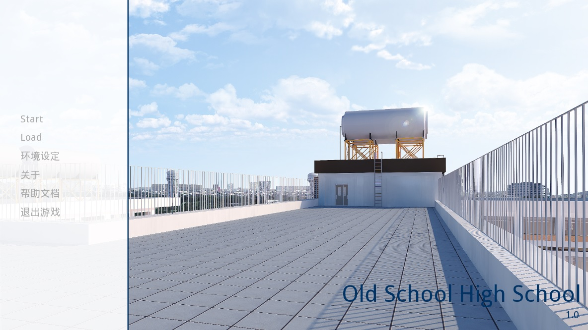](https://doc.renpy.cn/zh-CN/_images/easy_main_menu.jpg)

*只有 `gui/main_menu.png` 被替换后的主菜单。*[](https://doc.renpy.cn/zh-CN/gui.html#id25)

[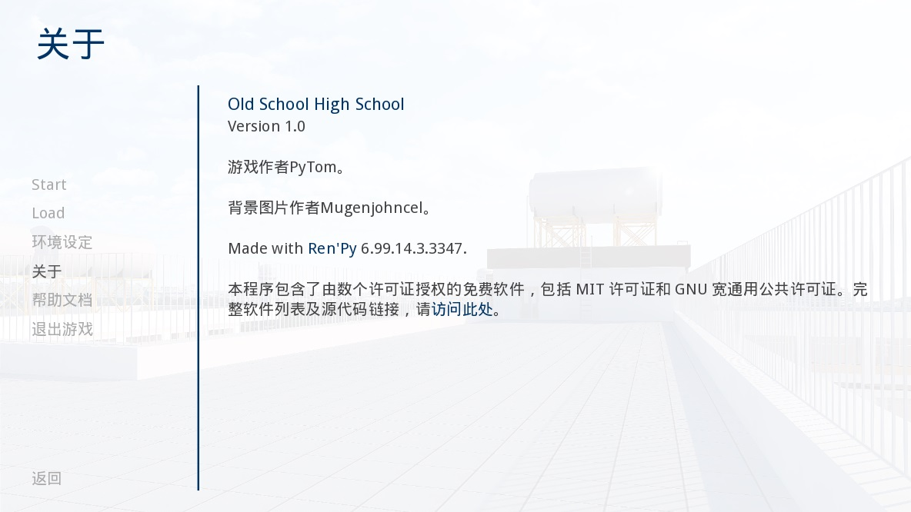](https://doc.renpy.cn/zh-CN/_images/easy_game_menu.jpg)

*“关于(about)”界面可以是游戏菜单(使用 `gui/main_menu.png` 文件作为背景)或者主菜单(使用 `gui/main_menu.png` 作为背景)。两种菜单可以被设置为同一张图片。*[](https://doc.renpy.cn/zh-CN/gui.html#id26)


### 窗口图标[](https://doc.renpy.cn/zh-CN/gui.html#window-icon)

正在运行程序都有一个对应的图标显示在某个地方(例如Windows平台的任务栏和mac电脑的dock)。

我们可以通过更换 `gui/window_icon.png` 改变窗口图标。

注意，改变gui/window_icon.png后，只对游戏正在运行时的图标有效。想要改变Windows平台的“.exe”文件和mac平台的应用程序图标，我们需要看看 [生成文档](https://doc.renpy.cn/zh-CN/build.html#special-files).


## 中级GUI定制化[](https://doc.renpy.cn/zh-CN/gui.html#intermediate-gui-customization)

接下来，我们会演示中级GUI定制化。定位于中等级别，就有可能改变游戏中的配色、字体和图片。大体上，中级定制化基本保留了界面的原样，比如按钮和条(bar)，不过会修改界面并添加一些新功能。

很多修改都可以通过在 `gui.rpy` 文件中编辑配置项实现。例如，需要增大字号，可以找到这样一行:

```
define gui.text_size = 22
```

增大或者减小字号的话，修改为:

```
define gui.text_size = 20
```

注意，一些默认值通常跟这份文档样例中并不一致。在创建游戏项目之初，就可以通过选择尺寸和颜色来修改这些默认值，而 `gui.rpy` 文件中的默认值可以看作可扩展GUI定制化的样例。可以搜索“The Question”项目中 `gui.rpy` 文件内各种配置项的定义，例如搜索 `define gui.text_size`。

接下去说的某些调整，会对部分或者全部对图片文件产生影响。例如在启动器选择“修改/更新 GUI”并要求引擎重新生成图片文件，导致图片文件本身被更新和改变。(但是注意，这种操作会导致你之前修改过的任何图片文件也被重新覆盖。)

你可能会等到游戏接近完成的情况下才考虑对 `gui.rpy` 进行定制化修改。老版本的 `gui.rpy` 文件可以在新版本的Re’Py中运行，新版本的 `gui.rpy` 文件可能会有老版本缺少的功能特性或者缺陷修复。在项目制作前期就定制化GUI可能会导致，很难利用这些改善和提升。


### 对话(dialogue)[](https://doc.renpy.cn/zh-CN/gui.html#dialogue)

与“向用户呈现对话相关的定制化”有关的内容有好几项。第一项是文本框(textbox)。

-   gui/textbox.png

    该文件包含了文本窗口的背景，为say(说话)界面中的一部分。虽然图片大小应该跟游戏分辨率吻合，但是文本内容应该只在中心左右60%的宽度范围内显示，两边各预留20%的边界。

另外，还有另外一些配置项可以定制化，用来改变对话的外观。

-   define gui.text_color = "#402000"[](https://doc.renpy.cn/zh-CN/gui.html#var-gui.text_color)

    该项设置对话文本颜色。

-   define gui.text_font = "ArchitectsDaughter.ttf"[](https://doc.renpy.cn/zh-CN/gui.html#var-gui.text_font)

    该项设置对话文本、菜单、输入和其他游戏内文字的字体。字体文件需要存在于game目录中。(译者注：“ArchitectsDaughter”字体不支持中文。后续截图中使用的是类似效果的“方正咆哮体”。)

-   define gui.text_size = 33[](https://doc.renpy.cn/zh-CN/gui.html#var-gui.text_size)

    设置对话文本字号。无论增大或缩小字号都需要注意符合文本显示区域的空间限制。

-   define gui.name_text_size = 45[](https://doc.renpy.cn/zh-CN/gui.html#var-gui.name_text_size)

    设置角色名字的文字字号。

角色名字标签(label)默认会使用强调色。定义角色时可以很简单地修改为需要的颜色:

```
define e = Character("Eileen", who_color="#104010")
```

[](https://doc.renpy.cn/zh-CN/_images/textbox.png)

*一个样例文本框(textbox)图片*[](https://doc.renpy.cn/zh-CN/gui.html#id27)

[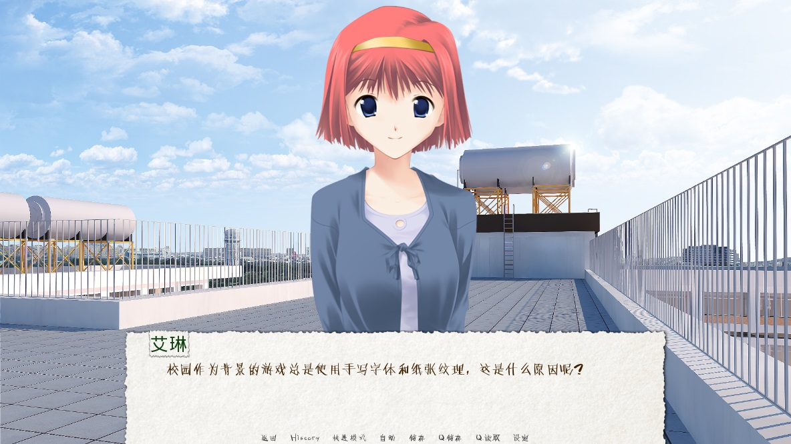](https://doc.renpy.cn/zh-CN/_images/easy_say_screen.jpg)

*使用以上描述定制化配置后的对话*[](https://doc.renpy.cn/zh-CN/gui.html#id28)


### 选项菜单(choice menu)[](https://doc.renpy.cn/zh-CN/gui.html#choice-menu)

选项界面使用menu语句向玩家展现选项。同样的，与选项界面的定制化配置有关的配置项有好几个。首先是两个图片文件:

-   gui/button/choice_idle_background.png

    该图片用作，未获取到焦点时，选项按钮的背景。

-   gui/button/choice_hover_background.png

    该图片用作，获取到焦点，选项按钮的背景。

默认情况下，文本被放置在这些图片的中心左右75%宽度范围内。还有一堆配置项可能控制选项按钮文本的颜色。

-   define gui.choice_button_text_idle_color = '#888888'[](https://doc.renpy.cn/zh-CN/gui.html#var-gui.choice_button_text_idle_color)

    未获取到焦点的选项按钮文本颜色。

-   define gui.choice_button_text_hover_color = '#0066cc'[](https://doc.renpy.cn/zh-CN/gui.html#var-gui.choice_button_text_hover_color)

    获取到焦点的选项按钮文本颜色。

只关注这几个配置项就可以满足简单定制化需求，而不需要改变图片尺寸。对于更复杂的定制化需求，再关注下面这些选项按钮的部分：

[](https://doc.renpy.cn/zh-CN/_images/choice_idle_background.png)

*`gui/button/idle_background.png` 的一个样例图片。*[](https://doc.renpy.cn/zh-CN/gui.html#id29)

[](https://doc.renpy.cn/zh-CN/_images/choice_hover_background.png)

*`gui/button/choice_hover_background.png` 的一个样例图片。*[](https://doc.renpy.cn/zh-CN/gui.html#id30)

[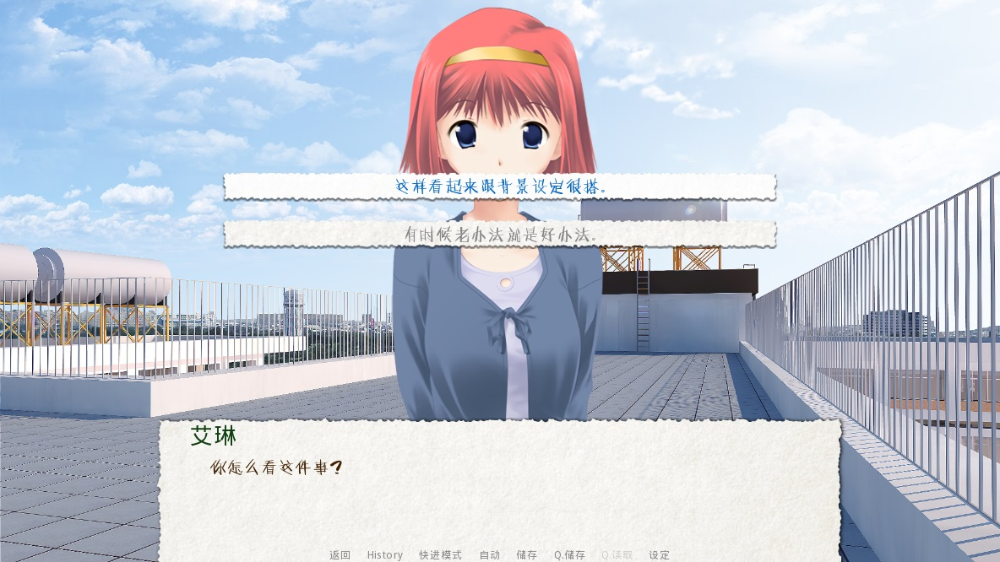](https://doc.renpy.cn/zh-CN/_images/easy_choice_screen.jpg)

*使用以上描述定制化配置后的选择界面样例。*[](https://doc.renpy.cn/zh-CN/gui.html#id31)


### 叠加图片(overlay image)[](https://doc.renpy.cn/zh-CN/gui.html#overlay-image)

还有一些叠加图片需要介绍。这些图片用于暗化或者亮化背景图片，使得按钮等其他用户图形组件更醒目。这些图片被放在overlay目录下：

-   gui/overlay/main_menu.png

    主菜单界面的叠加图片。

-   gui/overlay/game_menu.png

    “游戏菜单类”界面，包括读档、存档、preference(环境设定)、关于(about)、help(帮助)等，使用的叠加图片。在“The Question”游戏中，同一个叠加图像用在包括主菜单等各种界面上。

-   gui/overlay/confirm.png

    用在选择确认界面暗化背景的叠加图片。

这里有一些叠加图片样例文件，以及使用叠加图片后游戏界面的感观变化。

[](https://doc.renpy.cn/zh-CN/_images/main_menu.png)

*`gui/overlay/main_menu.png` 图片文件的一个样例。*[](https://doc.renpy.cn/zh-CN/gui.html#id32)

[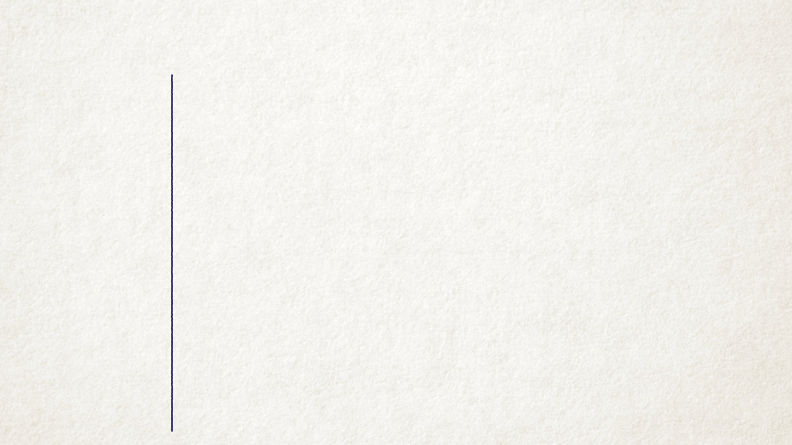](https://doc.renpy.cn/zh-CN/_images/game_menu.png)

*`gui/overlay/game_menu.png` 图片文件的一个样例。*[](https://doc.renpy.cn/zh-CN/gui.html#id33)

[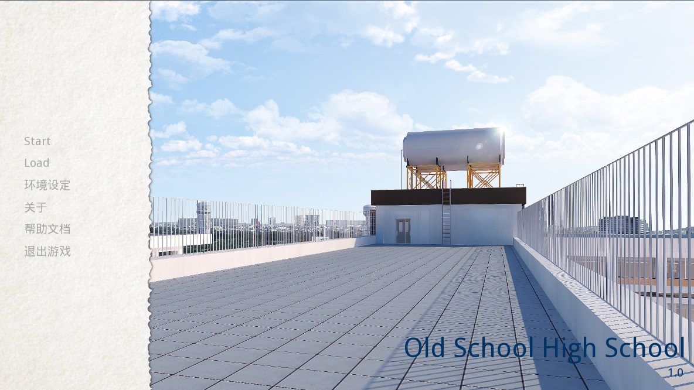](https://doc.renpy.cn/zh-CN/_images/overlay_main_menu.jpg)

*更换叠加图片后的主菜单界面。*[](https://doc.renpy.cn/zh-CN/gui.html#id34)

[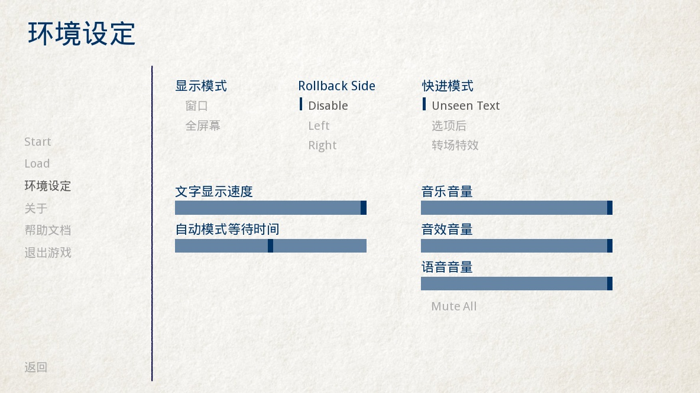](https://doc.renpy.cn/zh-CN/_images/overlay_game_menu.jpg)

*更换叠加图片后的游戏菜单界面。*[](https://doc.renpy.cn/zh-CN/gui.html#id35)


### 颜色，字体和字号[](https://doc.renpy.cn/zh-CN/gui.html#colors-fonts-and-font-sizes)

这里有一些GUI配置项可用于更改文本的颜色、字体和字号。

这些颜色配置项应该总是被设置为十六进制的颜色代码，格式为“#rrggbb”的字符串(或者“#rrggbbaa”这样带有alpha通道的字符串)，类似于在网页浏览器上常用的颜色代码。例如, "#663399"是 [靓紫色](http://www.economist.com/blogs/babbage/2014/06/digital-remembrance)的代码. 现在有不少在线工具用于查询HTML颜色代码，这是 [其中一个](http://htmlcolorcodes.com/color-picker/).

除了上面提到的 [`gui.text_color`](https://doc.renpy.cn/zh-CN/gui.html#var-gui.text_color) 、 `gui.choice_idle_color` 、 和 `gui.choice_hover_color` ， 还有下面这些配置项:

-   define gui.accent_color = '#000060'[](https://doc.renpy.cn/zh-CN/gui.html#var-gui.accent_color)

    在GUI很多地方都会使用的强调色，例如使用在标题和标签中。

-   define gui.idle_color = '#606060'[](https://doc.renpy.cn/zh-CN/gui.html#var-gui.idle_color)

    大多数按钮在未获取焦点或未被选择时的颜色。

-   define gui.idle_small_color = '#404040'[](https://doc.renpy.cn/zh-CN/gui.html#var-gui.idle_small_color)

    鼠标指针未悬停在小型文本上(例如存档槽的日期名字，及快捷菜单按钮的文字)的颜色。该颜色通常需要比idle_color更亮或者更暗，以抵消文字较小不易突出导致的负面效果。

-   define gui.hover_color = '#3284d6'[](https://doc.renpy.cn/zh-CN/gui.html#var-gui.hover_color)

    该颜色用于GUI中获得焦点(鼠标悬停)的组件，包括按钮的文本、滑块和滚动条(可动区域)的滑块。

-   define gui.selected_color = '#555555'[](https://doc.renpy.cn/zh-CN/gui.html#var-gui.selected_color)

    该颜色用于被选择的按钮文本。(这项优先级高于hover鼠标悬停和idle未获取焦点两种情况的颜色设置。)

-   define gui.insensitive_color = '#8888887f'[](https://doc.renpy.cn/zh-CN/gui.html#var-gui.insensitive_color)

    该颜色用于不接受用户输入的按钮的文本。(例如，一个rollback回滚按钮然而此时并不允许回滚。)

-   define gui.interface_text_color = '#404040'[](https://doc.renpy.cn/zh-CN/gui.html#var-gui.interface_text_color)

    该颜色用于游戏接口的静态文本，比如在帮助和关于界面上的文本。

-   define gui.muted_color = '#6080d0'[](https://doc.renpy.cn/zh-CN/gui.html#var-gui.muted_color)

    

-   define gui.hover_muted_color = '#8080f0'[](https://doc.renpy.cn/zh-CN/gui.html#var-gui.hover_muted_color)

    沉默色，用于条(bar)、滚动条和滑块无法正确展示数值或者可视区域时，这些组件某些部分的颜色。(这只会出现在重新生成图片，而启动器中图片无法马上生效的情况下。)

除了 [`gui.text_font`](https://doc.renpy.cn/zh-CN/gui.html#var-gui.text_font) 外,还有以下配置项与文本字体有关。配置的字体文件也应该要被放置在游戏目录中。

-   define gui.interface_text_font = "ArchitectsDaughter.ttf"[](https://doc.renpy.cn/zh-CN/gui.html#var-gui.interface_text_font)

    该字体用于用户接口元素的文本，例如主菜单与游戏菜单、按钮之类的。

-   define gui.system_font = "DejaVuSans.ttf"[](https://doc.renpy.cn/zh-CN/gui.html#var-gui.system_font)

    该字体用于系统文本，比如一场信息和Shift+A后的菜单。该字体应该能显示ASCII和游戏内用到的语言文字。

-   define gui.glyph_font = "DejaVuSans.ttf"[](https://doc.renpy.cn/zh-CN/gui.html#var-gui.glyph_font)

    该字体用于某种文本的字形(glyph)，例如用作跳过提示的箭头标志。DejaVuSans是一个针对这些字形的字体，而且已经自动包含在Ren’Py游戏中。

除了 [`gui.text_size`](https://doc.renpy.cn/zh-CN/gui.html#var-gui.text_size) 和 [`gui.name_text_size`](https://doc.renpy.cn/zh-CN/gui.html#var-gui.name_text_size) 外, 下面的几个配置项控制文本字号。

-   define gui.interface_text_size = 36[](https://doc.renpy.cn/zh-CN/gui.html#var-gui.interface_text_size)

    游戏用户接口静态文本的字号，也是游戏接口中按钮文本的默认字号。

-   define gui.label_text_size = 45[](https://doc.renpy.cn/zh-CN/gui.html#var-gui.label_text_size)

    游戏用户接口标签(label)部分的文本字号。

-   define gui.notify_text_size = 24[](https://doc.renpy.cn/zh-CN/gui.html#var-gui.notify_text_size)

    通知文本字号。

-   define gui.title_text_size = 75[](https://doc.renpy.cn/zh-CN/gui.html#var-gui.title_text_size)

    游戏标题字号。

[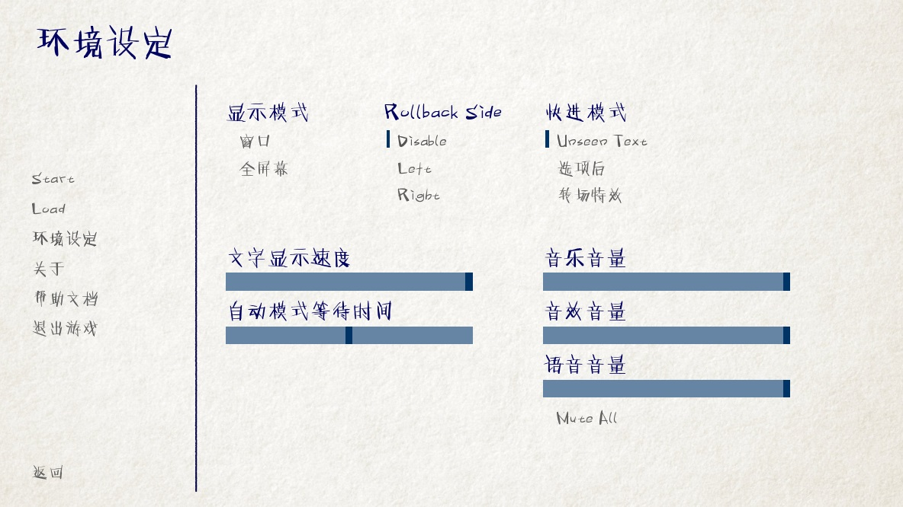](https://doc.renpy.cn/zh-CN/_images/text.jpg)

*定制化文本颜色、字体和字号后的游戏菜单*[](https://doc.renpy.cn/zh-CN/gui.html#id36)


### Borders(边界)[](https://doc.renpy.cn/zh-CN/gui.html#borders)

有一些GUI组件，例如按钮(button)和条(bar)，使用可伸缩的背景的话，还可以配置Borders(边界)对象。在讨论如何定制化按钮和条(bar)之前，我们首先描述一下边界的实现机制。

Borders(边界)是可视组件中 [`Frame()`](https://doc.renpy.cn/zh-CN/displayables.html#Frame) 类的可选成员。 一个Frame对象会使用一个图片，然后分割为9块——4块角落，4个边条及1块中心区域。4个角落总是保持相同的尺寸，左右边条水平对齐，上下边条垂直对齐，中心区域在两个维度上都对齐。

Borders(边界)对象按照“左、上、右、下”的顺序，依次给定了边界的尺寸。所以如果使用了如下边界图片的话:

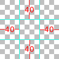

符合如下定义的Borders(边界)对象:

```
Borders(40, 40, 40, 40)
```

一个可能的结果是这样:

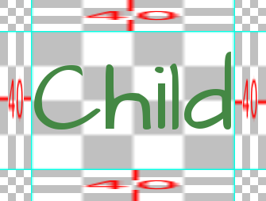

如果child文字大小发生变化，背景图片也会跟着变化。

一个Border对象也可以被给定padding(内边距)，包括负值的内边距会让child能超出原有范围叠加在边界上。例如，这样的Borderss:

```
Borders(40, 40, 40, 40, -20, -20, -20, -20)
```

允许child能够叠加在边条上。注意，由于overlap(叠加)效果导致了边条变小，因为Borders本身现在也占了更少空间。

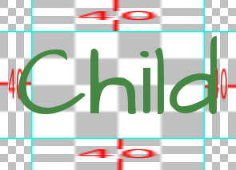

Borders(边界)也可以被tiled(复制码放)，而不仅仅是伸缩。这取决于配置项，产生的效果如下：

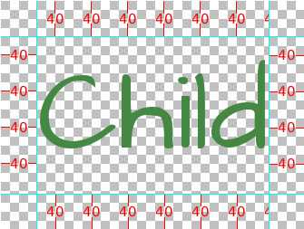

这些样例图片有一点丑，因为我们需要展现他们的工作机制。在练习环节，系统会产生一些更悦目的成果。一个Frame displayable对象被用于放置用户接口组件的Frame背景，我们将以这种情况作为案例。

主Frame窗口可以采用两种方式实现定制化。第一种方式是，更换背景图片文件：

-   gui/frame.png

    该图片用作主Frame窗口背景。

而第二种方式是定制化配置项。

-   define gui.frame_borders = Borders(15, 15, 15, 15)[](https://doc.renpy.cn/zh-CN/gui.html#var-gui.frame_borders)

    该border用于主Frame窗口。

-   define gui.confirm_frame_borders = Borders(60, 60, 60, 60)[](https://doc.renpy.cn/zh-CN/gui.html#var-gui.confirm_frame_borders)

    该border常用于confirm(确认)提示界面的frame。

-   define gui.frame_tile = True[](https://doc.renpy.cn/zh-CN/gui.html#var-gui.frame_tile)

    若为True，confirm(确认)提示界面的边条和中心会被tiled(复制码放)处理。若为False，做拉伸处理。

[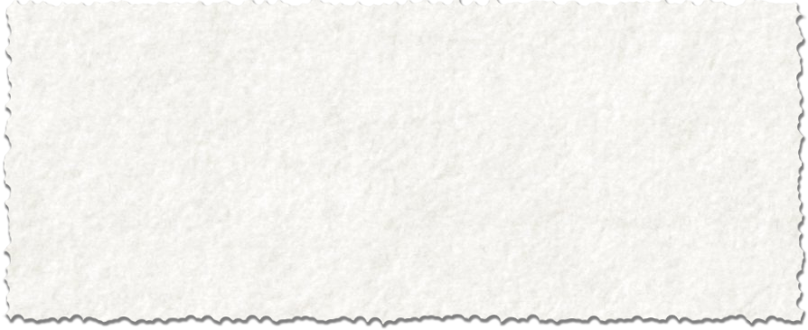](https://doc.renpy.cn/zh-CN/_images/frame.png)

*`gui/frame.png` 的一个样例图片。*[](https://doc.renpy.cn/zh-CN/gui.html#id37)

[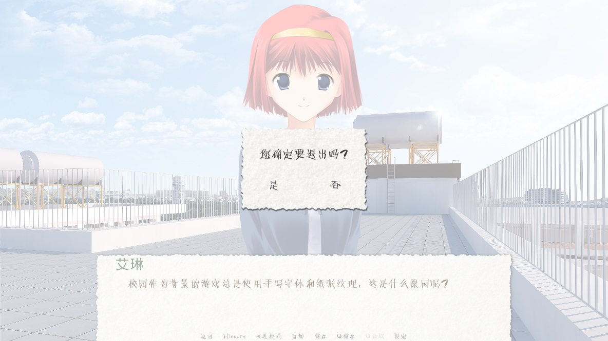](https://doc.renpy.cn/zh-CN/_images/frame_confirm.jpg)

*使用以上的定制化配置后的确认提示界面。*[](https://doc.renpy.cn/zh-CN/gui.html#id38)


### 按钮(button)[](https://doc.renpy.cn/zh-CN/gui.html#button)

(译者注：为了避免与键盘按键key混淆，文档内的button一律翻译为按钮。)

Ren’Py用户接口包括了大量的按钮(button)，这些按钮(button)具有不同的尺寸及不同的用途。最重要的几类按钮是:

-   button

    基础按钮。在用户接口中，对用户行为进行引导。

-   choice_button

    用于游戏内菜单的单项选择按钮。

-   quick_button

    游戏内快速进入游戏菜单的按钮。

-   navigation_button

    在主菜单和游戏菜单中，用于引导至其他界面和开始游戏的按钮。

-   page_button

    读档和存档界面用于翻页的按钮。

-   slot_button

    存档槽位按钮，包含了一个缩略图、存档时间和一个可选的存档名字。后面我们会谈到这些内容的具体细节。

-   radio_button

    在界面中多组单项选择的按钮。

-   check_button

    提供勾选项的按钮。

-   test_button

    环境设定设置界面上，用于音频回放的按钮。这个按钮应该在垂直高度上与滑块一致。

-   help_button

    用于玩家选择需要何种帮助的按钮。

-   confirm_button

    用在选择“是”或者“否”的确认界面的按钮。

-   nvl_button

    用于NVL模式下菜单选项的按钮。

下面这些图片文件用于定制化按钮背景，前提是这些文件存在。

-   gui/button/idle_background.png

    用于未获取焦点按钮的背景图片。

-   gui/button/hover_background.png

    用于获取焦点按钮的背景图片。

-   gui/button/selected_idle_background.png

    用于被选择但未获取焦点按钮的背景图片。这个图片属于可选的，仅在 `idle_background.png` 图片存在的情况下才有用。

-   gui/button/selected_hover_background.png

    用于被选择并获取到焦点按钮的背景图片。这个图片属于可选的，仅在 `hover_background.png` 图片存在的情况下才有用。

更多特定的背景可以用于对应类型的按钮，是否适用可以通过图片名的前缀判断。例如， `gui/button/check_idle_background.png` 可以用作check button中没有获取焦点选项的背景。

在radio button和check button中，有4个图片文件可以用作前景修饰，用于标识该选项是否被选中。

-   gui/button/check_foreground.png, gui/button/radio_foreground.png

    这两个图片用于check button或radio button未被选择的选项。

-   gui/button/check_selected_foreground.png, gui/button/radio_selected_foreground.png

    这两个图片用于check button或radio button被选中的选项。

下面的几个配置项设置了按钮的各类属性:

-   define gui.button_width = None[](https://doc.renpy.cn/zh-CN/gui.html#var-gui.button_width)

    

-   define gui.button_height = 64[](https://doc.renpy.cn/zh-CN/gui.html#var-gui.button_height)

    按钮的宽度和高度，使用像素作为单位。如果值配置为“None”，系统会基于两项内容自定义一个合适的大小。这两项内容之一是按钮上的文本尺寸，另一项则是下面提到的borders(边界)。

-   define gui.button_borders = Borders(10, 10, 10, 10)[](https://doc.renpy.cn/zh-CN/gui.html#var-gui.button_borders)

    borders(边界)以左、上、右、下的顺序围绕一个按钮。

-   define gui.button_tile = True[](https://doc.renpy.cn/zh-CN/gui.html#var-gui.button_tile)

    如果配置为True，按钮背景的中心区域和四条边将增缩自身尺寸，并以tile形式码放。如果配置为False，则中心区域和四边将使用缩放功能。

-   define gui.button_text_font = gui.interface_font[](https://doc.renpy.cn/zh-CN/gui.html#var-gui.button_text_font)

    

-   define gui.button_text_size = gui.interface_text_size[](https://doc.renpy.cn/zh-CN/gui.html#var-gui.button_text_size)

    按钮文本的字体与字号。

-   define gui.button_text_idle_color = gui.idle_color[](https://doc.renpy.cn/zh-CN/gui.html#var-gui.button_text_idle_color)

    

-   define gui.button_text_hover_color = gui.hover_color[](https://doc.renpy.cn/zh-CN/gui.html#var-gui.button_text_hover_color)

    

-   define gui.button_text_selected_color = gui.accent_color[](https://doc.renpy.cn/zh-CN/gui.html#var-gui.button_text_selected_color)

    

-   define gui.button_text_insensitive_color = gui.insensitive_color[](https://doc.renpy.cn/zh-CN/gui.html#var-gui.button_text_insensitive_color)

    各种情景下按钮文本的颜色。

-   define gui.button_text_xalign = 0.0[](https://doc.renpy.cn/zh-CN/gui.html#var-gui.button_text_xalign)

    按钮文本的垂直方向对齐方式。0.0为左对齐，0.5为中央对齐，1.0为右对齐。

-   define gui.button_image_extension = ".png"[](https://doc.renpy.cn/zh-CN/gui.html#var-gui.button_image_extension)

    按钮图像的扩展名。这项可以修改为“.webp”，使用WEBP图片。

这些变量能以前缀形式，加在某个特定种类的图像特性前面。例如， [`gui.choice_button_text_idle_color`](https://doc.renpy.cn/zh-CN/gui.html#var-gui.choice_button_text_idle_color) 配置了一个idle状态单选按钮的颜色。

举个例子，我们在样例游戏中将这些变量配置如下：

-   define gui.navigation_button_width = 290[](https://doc.renpy.cn/zh-CN/gui.html#var-gui.navigation_button_width)

    增加了navigation button的宽度。

-   define gui.radio_button_borders = Borders(40, 10, 10, 10)[](https://doc.renpy.cn/zh-CN/gui.html#var-gui.radio_button_borders)

    

-   define gui.check_button_borders = Borders(40, 10, 10, 10)[](https://doc.renpy.cn/zh-CN/gui.html#var-gui.check_button_borders)

    增加了radio button和check button的borders(边界)宽度，为左侧的check mark(选定标记)预留出空间。

这有一个游戏中界面一些元素如何被定制化例子。


*`gui/button/idle_background.png` 样例图片。*[](https://doc.renpy.cn/zh-CN/gui.html#id39)


*`gui/button/hover_background.png` 样例图片。*[](https://doc.renpy.cn/zh-CN/gui.html#id40)


*可用作 `gui/button/check_foreground.png` 和 `gui/button/radio_foreground.png` 的样例图片。*[](https://doc.renpy.cn/zh-CN/gui.html#id41)


*可用作 `gui/button/check_selected_foreground.png` 和 `gui/button/radio_selected_foreground.png` 的样例图片。*[](https://doc.renpy.cn/zh-CN/gui.html#id42)

[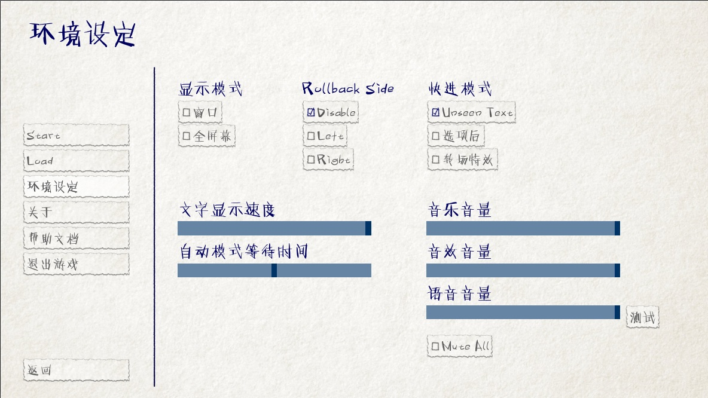](https://doc.renpy.cn/zh-CN/_images/button_preferences.jpg)

*使用本段讨论的各种定制化配置后的环境设定界面。*[](https://doc.renpy.cn/zh-CN/gui.html#id43)


### 存档槽位按钮[](https://doc.renpy.cn/zh-CN/gui.html#save-slot-buttons)

读档和存档界面使用存档槽位按钮，这类按钮展示了一个缩略图以及文件保存时间信息。当用于定制化存档槽位尺寸时，下面这些配置项十分有用。

-   define gui.slot_button_width = 414[](https://doc.renpy.cn/zh-CN/gui.html#var-gui.slot_button_width)

    

-   define gui.slot_button_height = 309[](https://doc.renpy.cn/zh-CN/gui.html#var-gui.slot_button_height)

    存档槽位按钮的宽度和高度。

-   define gui.slot_button_borders = Borders(15, 15, 15, 15)[](https://doc.renpy.cn/zh-CN/gui.html#var-gui.slot_button_borders)

    每一个存档槽位的borders。

[`config.thumbnail_width`](https://doc.renpy.cn/zh-CN/config.html#var-config.thumbnail_width) = 384 和 [`config.thumbnail_height`](https://doc.renpy.cn/zh-CN/config.html#var-config.thumbnail_height) = 216 设置存档缩略图的宽度和高度。注意这两个配置项的定义在命名空间config中，而不在命名空间gui中。通过文件的保存和读取，这些配置才会生效。

-   define gui.file_slot_cols = 3[](https://doc.renpy.cn/zh-CN/gui.html#var-gui.file_slot_cols)

    

-   define gui.file_slot_rows = 2[](https://doc.renpy.cn/zh-CN/gui.html#var-gui.file_slot_rows)

    存档槽位坐标的行数和列数。

这些是用于存档槽位的背景图片。

-   gui/button/slot_idle_background.png

    未获取焦点存档槽位的背景图片。

-   gui/button/slot_hover_background.png

    获取到焦点存档槽位的背景图片。

将这些都投入使用后，我们得到了：

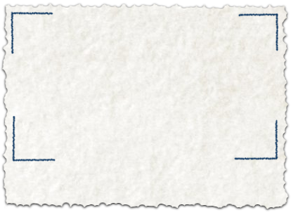

*`gui/button/slot_idle_background.png` 样例图片*[](https://doc.renpy.cn/zh-CN/gui.html#id44)

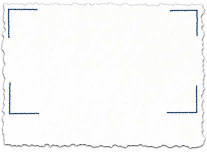

*`gui/button/slot/slot_hover_background.png` 样例图片。*[](https://doc.renpy.cn/zh-CN/gui.html#id45)

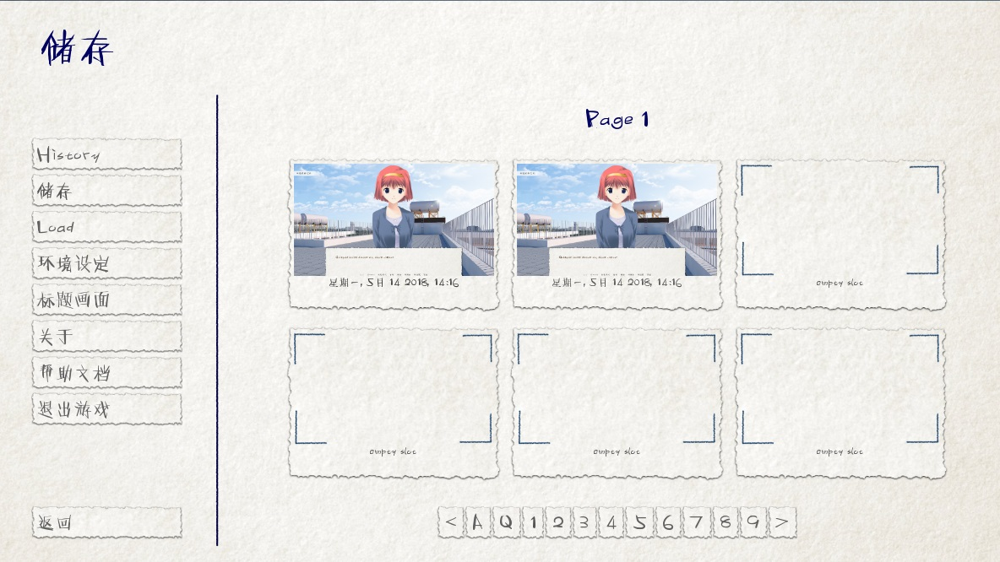

*应用本节讨论的各项定制化后的存档界面。*[](https://doc.renpy.cn/zh-CN/gui.html#id46)


### 滑块(slider)[](https://doc.renpy.cn/zh-CN/gui.html#slider)

滑块(slider)是一类用在环境设定界面的条(bar)，允许玩家可以根据自身喜好调整大量的数值。GUI默认只使用横向的滑块，不过游戏中也往往会用到垂直的滑块。

滑块(slider)可以使用以下图片进行定制化：

-   gui/slider/horizontal_idle_bar.png, gui/slider/horizontal_hover_bar.png, gui/slider/vertical_idle_bar.png, gui/slider/vertical_hover_bar.png

    用于空闲和指针悬停状态下垂直或水平滑块的背景图片。

-   gui/slider/horizontal_idle_thumb.png, gui/slider/horizontal_hover_thumb.png, gui/slider/vertical_idle_thumb.png, gui/slider/vertical_hover_thumb.png

    用于条(bar)的thumb(可拖动部分)的图片。

以下配置项也会被用到:

-   define gui.slider_size = 64[](https://doc.renpy.cn/zh-CN/gui.html#var-gui.slider_size)

    水平滑动块的高度，或者垂直滑块的宽度。

-   define gui.slider_tile = True[](https://doc.renpy.cn/zh-CN/gui.html#var-gui.slider_tile)

    若为True，Frame中包含的滑块会被tile样式码放。若为False，则使用缩放模式。

-   define gui.slider_borders = Borders(6, 6, 6, 6)[](https://doc.renpy.cn/zh-CN/gui.html#var-gui.slider_borders)

    

-   define gui.vslider_borders = Borders(6, 6, 6, 6)[](https://doc.renpy.cn/zh-CN/gui.html#var-gui.vslider_borders)

    Frame包含条(bar)图片时使用的borders(边界)。

这是一个我们如何定制化水平滑块的案例。


*`gui/slider/horizontal_idle_bar.png` 样例图片。*[](https://doc.renpy.cn/zh-CN/gui.html#id47)


*`gui/slider/horizontal_hover_bar.png` 样例图片。*[](https://doc.renpy.cn/zh-CN/gui.html#id48)


*`gui/slider/horizontal_idle_thumb.png` 样例图片。*[](https://doc.renpy.cn/zh-CN/gui.html#id49)


*`gui/slider/horizontal_hover_thumb.png` 样例图片。*[](https://doc.renpy.cn/zh-CN/gui.html#id50)

[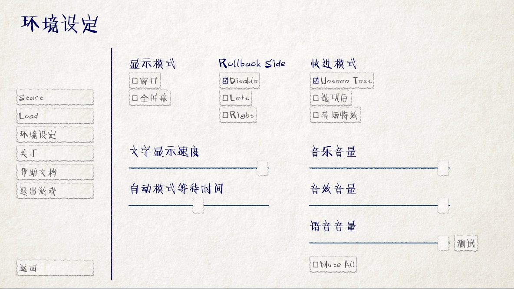](https://doc.renpy.cn/zh-CN/_images/slider_preferences.jpg)

*应用本节提到的定制化后的界面效果。*[](https://doc.renpy.cn/zh-CN/gui.html#id51)


### scrollbar(滚动条)[](https://doc.renpy.cn/zh-CN/gui.html#scrollbar)

scrollbar(滚动条)是用于滚动视点的条(bar)。在GUI中，历史(history)界面是滚动条明显会被用到的地方，但垂直滚动条在其他界面也可能会被用到。

scrollbar(滚动条)可以使用以下图片定制化：

-   gui/scrollbar/horizontal_idle_bar.png, gui/scrollbar/horizontal_hover_bar.png, gui/scrollbar/vertical_idle_bar.png, gui/scrollbar/vertical_hover_bar.png

    在空闲(未获取焦点)及鼠标悬停状态下，垂直滚动条的背景图片。

-   gui/scrollbar/horizontal_idle_thumb.png, gui/scrollbar/horizontal_hover_thumb.png, gui/scrollbar/vertical_idle_thumb.png, gui/scrollbar/vertical_hover_thumb.png

    thumb(可拖动部分)使用图片——滚动条的可活动滑块部分。

还有下面这些配置项可能会被用到：

-   define gui.scrollbar_size = 24[](https://doc.renpy.cn/zh-CN/gui.html#var-gui.scrollbar_size)

    水平滚动条的高度，也是垂直滚动条的宽度

-   define gui.scrollbar_tile = True[](https://doc.renpy.cn/zh-CN/gui.html#var-gui.scrollbar_tile)

    如果该值为True，包含scrollbar(滚动条)的frame(框架)使用tile样式码放。如果该值为False，则使用scale缩放样式。

-   define gui.scrollbar_borders = Borders(10, 6, 10, 6)[](https://doc.renpy.cn/zh-CN/gui.html#var-gui.scrollbar_borders)

    

-   define gui.vscrollbar_borders = Borders(6, 10, 6, 10)[](https://doc.renpy.cn/zh-CN/gui.html#var-gui.vscrollbar_borders)

    滚动条使用frame(框架)中包含的border(边界)。

-   define gui.unscrollable = "hide"[](https://doc.renpy.cn/zh-CN/gui.html#var-gui.unscrollable)

    当一个滚动条无法滚动(即所有内容都可以在一栏内显示)，该项决定滚动条的展示。“hide”表示隐藏该滚动条，不指定值则表示展示滚动条。

这是一个如何定制化垂直滚动条的例子。

[](https://doc.renpy.cn/zh-CN/_images/vertical_idle_bar.png)

*`gui/scrollbar/vertical_idle_bar.png` 样例图片*[](https://doc.renpy.cn/zh-CN/gui.html#id52)

[](https://doc.renpy.cn/zh-CN/_images/vertical_hover_bar.png)

*`gui/scrollbar/vertical_hover_bar.png` 样例图片*[](https://doc.renpy.cn/zh-CN/gui.html#id53)

[](https://doc.renpy.cn/zh-CN/_images/vertical_idle_thumb.png)

*`gui/scrollbar/vertical_idle_thumb.png` 样例图片*[](https://doc.renpy.cn/zh-CN/gui.html#id54)

[](https://doc.renpy.cn/zh-CN/_images/vertical_hover_thumb.png)

*`gui/scrollbar/vertical_hover_thumb.png` 样例图片*[](https://doc.renpy.cn/zh-CN/gui.html#id55)

[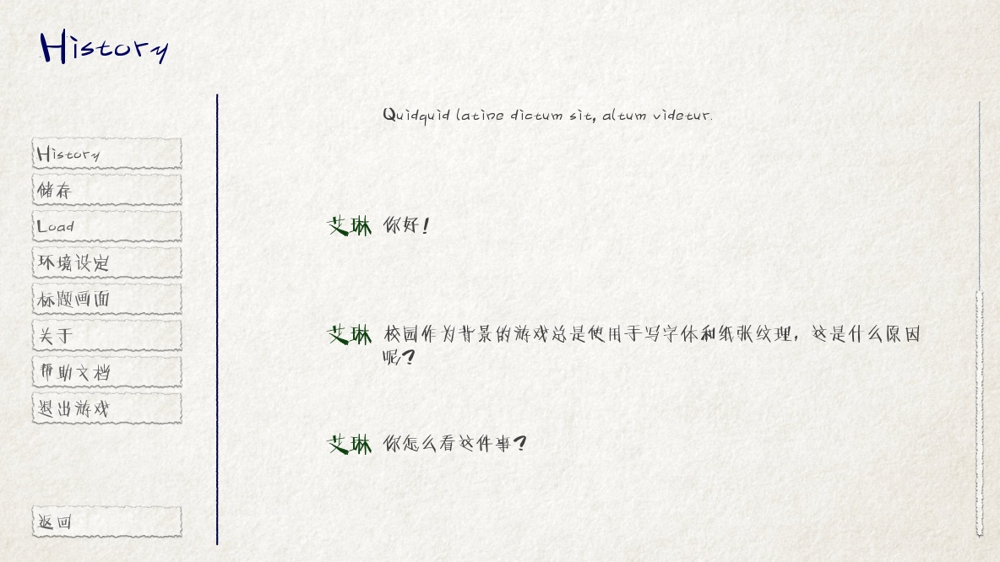](https://doc.renpy.cn/zh-CN/_images/scrollbar_history.jpg)

*使用本节中提到的定制化内容后的历史(history)界面。*[](https://doc.renpy.cn/zh-CN/gui.html#id56)

### 条(bar)[](https://doc.renpy.cn/zh-CN/gui.html#bar)

最常见的老式条(bar)会向用户展示一个进度数字。条(bar)不会用在GUI中，但会用在创作者定义的(creator-defined)界面中。

通过编辑以下图片可以实现条(bar)的定制化：

-   gui/bar/left.png, gui/bar/bottom.png

    用于水平和垂直条(bar)的填充图片

-   gui/bar/right.png, gui/bar/top.png

    用于水平和垂直条(bar)的填充图片

还有一些用于条(bar)的常用配置项：

-   define gui.bar_size = 64[](https://doc.renpy.cn/zh-CN/gui.html#var-gui.bar_size)

    水平条(bar)的高度，也是垂直条(bar)的宽度。

-   define gui.bar_tile = False[](https://doc.renpy.cn/zh-CN/gui.html#var-gui.bar_tile)

    如果该值为True，条(bar)图片以tile样式码放。如果该值为False，条(bar)图片以scale样式缩放。

-   define gui.bar_borders = Borders(10, 10, 10, 10)[](https://doc.renpy.cn/zh-CN/gui.html#var-gui.bar_borders)

    

-   define gui.vbar_borders = Borders(10, 10, 10, 10)[](https://doc.renpy.cn/zh-CN/gui.html#var-gui.vbar_borders)

    包含在frame(框架)中的border(边界)。

这是一个定制化水平条(bar)的样例。

[](https://doc.renpy.cn/zh-CN/_images/left.png)

*`gui/bar/left.png` 样例图片*[](https://doc.renpy.cn/zh-CN/gui.html#id57)

[](https://doc.renpy.cn/zh-CN/_images/right.png)

*`gui/bar/right.png` 样例图片*[](https://doc.renpy.cn/zh-CN/gui.html#id58)

[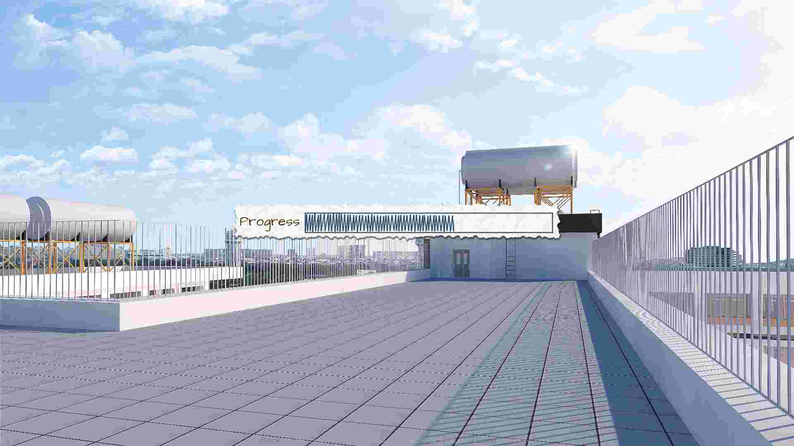](https://doc.renpy.cn/zh-CN/_images/bar.jpg)

*经过我们定制化后的条(bar)样例。*[](https://doc.renpy.cn/zh-CN/gui.html#id59)


### 跳过(skip)和通知(notify)[](https://doc.renpy.cn/zh-CN/gui.html#skip-notify)

跳过(skip)和通知(notify)界面会同时在主Frame带着信息出现。他们共用frame背景图片：

-   gui/skip.png

    跳过(skip)提示的背景图。

-   gui/notify.png

    通知(notify)界面的背景图。

控制这些的配置项如下:

-   define gui.skip_frame_borders = Borders(24, 8, 75, 8)[](https://doc.renpy.cn/zh-CN/gui.html#var-gui.skip_frame_borders)

    frame中的边界，用在跳过(skip)界面

-   define gui.notify_frame_borders = Borders(24, 8, 60, 8)[](https://doc.renpy.cn/zh-CN/gui.html#var-gui.notify_frame_borders)

    frame中的边界，用在通知(notify)界面。

-   define gui.skip_ypos = 15[](https://doc.renpy.cn/zh-CN/gui.html#var-gui.skip_ypos)

    从窗口顶部算起，跳过(skip)提示的垂直位置，以像素为单位。

-   define gui.notify_ypos = 68[](https://doc.renpy.cn/zh-CN/gui.html#var-gui.notify_ypos)

    从窗口顶部算起，通知(notify)提示的垂直位置，以像素为单位。

这是一个定制化跳过(skip)和通知(notify)的样例。

[](https://doc.renpy.cn/zh-CN/_images/skip.png)

*`gui/skip.png` 样例图片。*[](https://doc.renpy.cn/zh-CN/gui.html#id60)

[](https://doc.renpy.cn/zh-CN/_images/notify.png)

*`gui/notify.png` 样例图片。*[](https://doc.renpy.cn/zh-CN/gui.html#id61)


*定制化后，跳过(skip)和通知(notify)界面的实际情况。*[](https://doc.renpy.cn/zh-CN/gui.html#id62)


### 对话(dialogue)-续[](https://doc.renpy.cn/zh-CN/gui.html#dialogue-continued)

除了以上提到的简单定制化，还有一些控制对话表现方式的路子。


#### 文本框(textbox)[](https://doc.renpy.cn/zh-CN/gui.html#textbox)

对话显示在文本框(textbox)或者窗口中。除了更换gui/textbox.png图片之外，下面的配置项也能控制文本框展示效果。


#### 名字(name)和名字框(namebox)[](https://doc.renpy.cn/zh-CN/gui.html#name-namebox)

frame(框架)会使用gui/namebox.png做为名字背景，角色名字则内置在该frame中。并且，有一些配置项控制名字的表现效果。正在说话的角色如果有名字的话，名字框(namebox)是唯一能显示这个名字的地方(包括名字为空“ ”的情况)。

-   define gui.name_xpos = 360[](https://doc.renpy.cn/zh-CN/gui.html#var-gui.name_xpos)

    

-   define gui.name_ypos = 0[](https://doc.renpy.cn/zh-CN/gui.html#var-gui.name_ypos)

    名字(name)和名字框(namebox)的水平和垂直位置。通常我们会在文本框的左端和上端预留几个像素的空间。把该配置项赋值为0.5，则可以让名字在文本框内居中(见下面的附图)。赋值可以是负数——例如，把gui.name_ypos赋值为“-22”就会使其在超过文本框顶端22个像素。

-   define gui.name_xalign = 0.0[](https://doc.renpy.cn/zh-CN/gui.html#var-gui.name_xalign)

    角色名字水平对齐方式。0.0表左对齐，0.5表示居中，1.0表示右对齐。(常用0.0或者0.5)这个配置项会同时应用在两处：gui.name_xpos相关的名字框(namebox)位置，选择何种对齐方式及对应边框的xpos值。

-   define gui.namebox_width = None[](https://doc.renpy.cn/zh-CN/gui.html#var-gui.namebox_width)

    

-   define gui.namebox_height = None[](https://doc.renpy.cn/zh-CN/gui.html#var-gui.namebox_height)

    

-   define gui.namebox_borders = Borders(5, 5, 5, 5)[](https://doc.renpy.cn/zh-CN/gui.html#var-gui.namebox_borders)

    

-   define gui.namebox_tile = False[](https://doc.renpy.cn/zh-CN/gui.html#var-gui.namebox_tile)

    这些配置项控制包含名字框(namebox)frame的显示效果。


#### 对话(dialogue)[](https://doc.renpy.cn/zh-CN/gui.html#dialogue-2)

-   define gui.dialogue_xpos = 402[](https://doc.renpy.cn/zh-CN/gui.html#var-gui.dialogue_xpos)

    

-   define gui.dialogue_ypos = 75[](https://doc.renpy.cn/zh-CN/gui.html#var-gui.dialogue_ypos)

    实际对话内容的水平和垂直位置。这通常表示从文本框(textbox)的左端或者顶端开始计算，偏离的像素数。如果设置为0.5则会让对话内容在文本框(textbox)内居中(参见下面的内容)。

-   define gui.dialogue_width = 1116[](https://doc.renpy.cn/zh-CN/gui.html#var-gui.dialogue_width)

    该配置项给定了每行对话内容的最大宽度，单位为像素。当对话内容达到最大宽度时，Ren’Py会将文本换行。

-   define gui.dialogue_text_xalign = 0.0[](https://doc.renpy.cn/zh-CN/gui.html#var-gui.dialogue_text_xalign)

    对话内容文本的水平对齐方式。0.0为左对齐，0.5为居中，1.0为右对齐。


#### 样例[](https://doc.renpy.cn/zh-CN/gui.html#gui-examples)

若要角色名字居中，使用:

```
define gui.name_xpos = 0.5
define gui.name_xalign = 0.5
```

若要对话内容文本居中，使用:

```
define gui.dialogue_xpos = 0.5
define gui.dialogue_text_xalign = 1.0
```

我们提供的演示游戏中，这些语句定制了居中的名字框(namebox):

```
define gui.namebox_width = 300
define gui.name_ypos = -22
define gui.namebox_borders = Borders(15, 7, 15, 7)
define gui.namebox_tile = True
```


*`gui/namebox.png` 样例图片。*[](https://doc.renpy.cn/zh-CN/gui.html#id63)

[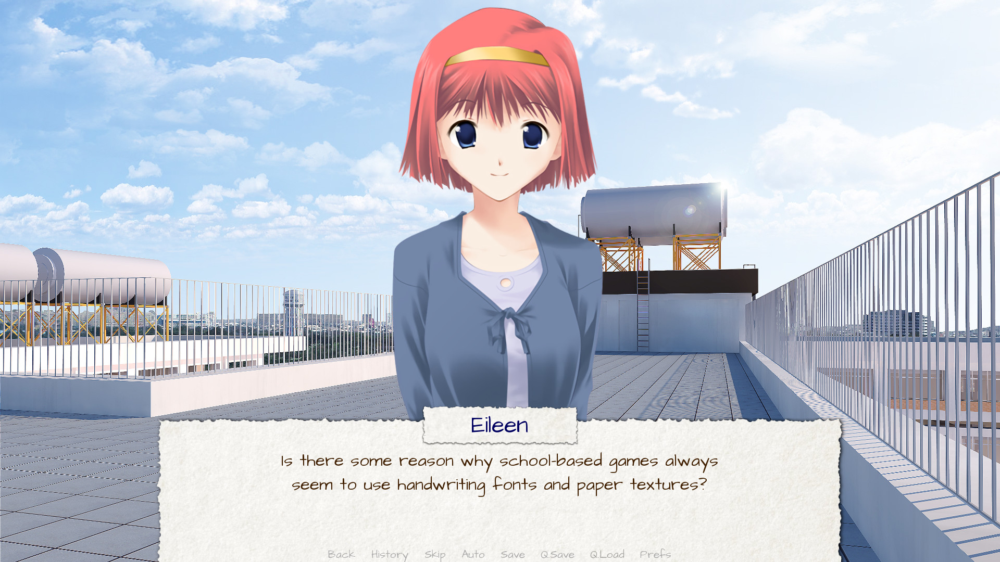](https://doc.renpy.cn/zh-CN/_images/intermediate_dialogue.jpg)

*应用以上定制化设置后的样例游戏。*[](https://doc.renpy.cn/zh-CN/gui.html#id64)


### 历史(history)[](https://doc.renpy.cn/zh-CN/gui.html#history)

这里有一些配置项可以控制历史(history)界面的展现效果。

[`config.history_length`](https://doc.renpy.cn/zh-CN/config.html#var-config.history_length) 配置项默认值为250，表示Ren’Py会保存的历史对话段落数。

-   define gui.history_height = 210[](https://doc.renpy.cn/zh-CN/gui.html#var-gui.history_height)

    历史(history)层(entry)的高度，单位为像素。该项可以为空，这样可以允许历史(history)层(entry)高度根据实际情况而定——当define gui.history_height为None时，config.history_length可能需要被明显调低。

-   define gui.history_spacing = 0[](https://doc.renpy.cn/zh-CN/gui.html#var-gui.history_spacing)

    各段历史对话的间隔距离，单位为像素。

-   define gui.history_name_xpos = 0.5[](https://doc.renpy.cn/zh-CN/gui.html#var-gui.history_name_xpos)

    

-   define gui.history_text_xpos = 0.5[](https://doc.renpy.cn/zh-CN/gui.html#var-gui.history_text_xpos)

    名字标签(name label)和对话文本的水平位置。这两者可以是历史(history)层(entry)左端偏移的像素数量，也可以是0.5表示居中。

-   define gui.history_name_ypos = 0[](https://doc.renpy.cn/zh-CN/gui.html#var-gui.history_name_ypos)

    

-   define gui.history_text_ypos = 60[](https://doc.renpy.cn/zh-CN/gui.html#var-gui.history_text_ypos)

    名字标签(name label)和对话文本的垂直位置，与历史(history)层(entry)上端位置有关，单位为像素。

-   define gui.history_name_width = 225[](https://doc.renpy.cn/zh-CN/gui.html#var-gui.history_name_width)

    

-   define gui.history_text_width = 1110[](https://doc.renpy.cn/zh-CN/gui.html#var-gui.history_text_width)

    名字标签(name label)和对话文本的宽度，单位为像素。

-   define gui.history_name_xalign = 0.5[](https://doc.renpy.cn/zh-CN/gui.html#var-gui.history_name_xalign)

    

-   define gui.history_text_xalign = 0.5[](https://doc.renpy.cn/zh-CN/gui.html#var-gui.history_text_xalign)

    名字标签(name label)和对话文本的对齐方式，及对应的文本对齐时使用的xpos值。0.0为左对齐，0.5为居中，1.0为右对齐。

[](https://doc.renpy.cn/zh-CN/_images/history.png)

*应用以上定制化配置后的历史(history)界面。*[](https://doc.renpy.cn/zh-CN/gui.html#id65)


### NVL[](https://doc.renpy.cn/zh-CN/gui.html#nvl)

nvl界面会显示NVL模式的对话。这也可以使用一些方式进行定制化。第一种是定制化NVL模式的背景图片：

-   gui/nvl.png

    NVL模式中使用的背景图片。这个图片应该跟窗口尺寸一致。

还有一些配置项用于定制化NVL模式文本下的显示效果。

-   define gui.nvl_borders = Borders(0, 15, 0, 30)[](https://doc.renpy.cn/zh-CN/gui.html#var-gui.nvl_borders)

    NVL模式围绕背景图的border(边界)。由于背景图不是一个frame，所以只用在淡出NVL模式，以防止直接切换导致的界面四周突兀表现。

-   define gui.nvl_height = 173[](https://doc.renpy.cn/zh-CN/gui.html#var-gui.nvl_height)

    NVL模式一个层(entry)的高度。配置该值可以调整层(entry)高度，使得在NVL模式下不翻页也可行，同时展现调整好的一系列层(entry)。将该值赋值为None的话，层(entry)的高度就是可变的(自适应)。

-   define gui.nvl_spacing = 15[](https://doc.renpy.cn/zh-CN/gui.html#var-gui.nvl_spacing)

    当gui.nvl_height的值为None时，各个层(entry)之间的spacing(间隔)大小，也是NVL模式菜单按钮的间隔大小。

-   define gui.nvl_name_xpos = 0.5[](https://doc.renpy.cn/zh-CN/gui.html#var-gui.nvl_name_xpos)

    

-   define gui.nvl_text_xpos = 0.5[](https://doc.renpy.cn/zh-CN/gui.html#var-gui.nvl_text_xpos)

    

-   define gui.nvl_thought_xpos = 0.5[](https://doc.renpy.cn/zh-CN/gui.html#var-gui.nvl_thought_xpos)

    角色名字、对话文本和thought/narration(内心活动/叙述)文本的位置，与层(entry)的左端位置有关。其可以是一个代表像素数的值，或者0.5表示在层(entry)内居中。

-   define gui.nvl_name_xalign = 0.5[](https://doc.renpy.cn/zh-CN/gui.html#var-gui.nvl_name_xalign)

    

-   define gui.nvl_text_xalign = 0.5[](https://doc.renpy.cn/zh-CN/gui.html#var-gui.nvl_text_xalign)

    

-   define gui.nvl_thought_xalign = 0.5[](https://doc.renpy.cn/zh-CN/gui.html#var-gui.nvl_thought_xalign)

    文本对齐。这项同时控制文本对齐方式，及文本起始距离左端的xpos值。0.0为左对齐，0.5为居中，1.0为右对齐。

-   define gui.nvl_name_ypos = 0[](https://doc.renpy.cn/zh-CN/gui.html#var-gui.nvl_name_ypos)

    

-   define gui.nvl_text_ypos = 60[](https://doc.renpy.cn/zh-CN/gui.html#var-gui.nvl_text_ypos)

    

-   define gui.nvl_thought_ypos = 0[](https://doc.renpy.cn/zh-CN/gui.html#var-gui.nvl_thought_ypos)

    角色名字、对话文本、thought/narration(内心活动/叙述)文本的位置，与层(entry)的上端相关。该值应是一个从上端开始的偏移量数值，单位为像素。

-   define gui.nvl_name_width = 740[](https://doc.renpy.cn/zh-CN/gui.html#var-gui.nvl_name_width)

    

-   define gui.nvl_text_width = 740[](https://doc.renpy.cn/zh-CN/gui.html#var-gui.nvl_text_width)

    

-   define gui.nvl_thought_width = 740[](https://doc.renpy.cn/zh-CN/gui.html#var-gui.nvl_thought_width)

    各种文本的宽度，单位为像素。

-   define gui.nvl_button_xpos = 0.5[](https://doc.renpy.cn/zh-CN/gui.html#var-gui.nvl_button_xpos)

    

-   define gui.nvl_button_xalign = 0.5[](https://doc.renpy.cn/zh-CN/gui.html#var-gui.nvl_button_xalign)

    NVL模式下菜单按钮的位置和对齐方式。

Ren’Py默认不使用NVL模式。调用NVL模式必须使用NVL模式角色，而NVL模式角色需要在 `script.rpy` 文件中定义一系列配置项。

```
define e = Character("Eileen", kind=nvl)
define narrator = nvl_narrator
define menu = nvl_menu
```

这是一个应用以上定制化配置后的NVL界面样例。

[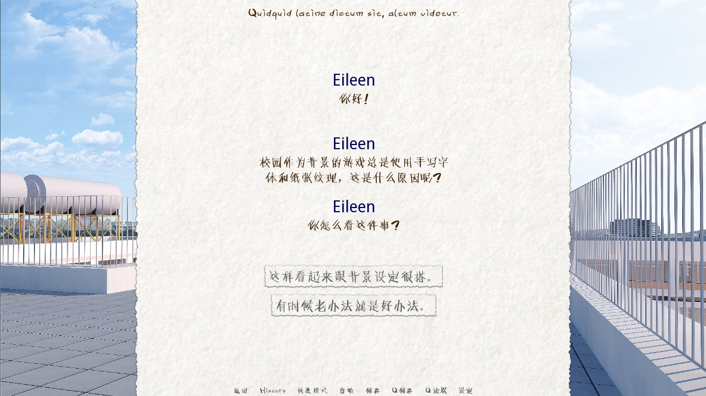](https://doc.renpy.cn/zh-CN/_images/nvl.jpg)

*应用以上定制化配置后的样例。*[](https://doc.renpy.cn/zh-CN/gui.html#id66)


### 文本(Text)[](https://doc.renpy.cn/zh-CN/gui.html#text)

大部分文本都可以利用GUI的配置项实现定制化。以下列出了可以使用的配置项：

-   define gui.kind_text_font[](https://doc.renpy.cn/zh-CN/gui.html#var-gui.kind_text_font)

    文本字体。

-   define gui.kind_text_size[](https://doc.renpy.cn/zh-CN/gui.html#var-gui.kind_text_size)

    文本字号。

-   define gui.kind_text_color[](https://doc.renpy.cn/zh-CN/gui.html#var-gui.kind_text_color)

    文本颜色。

其他 [文本样式特性](https://doc.renpy.cn/zh-CN/style_properties.html#text-style-properties) 也可以通过相同的方式来设置。 例如，gui.kind_text_outlines设置了 [`outlines`](https://doc.renpy.cn/zh-CN/style_properties.html#style-property-outlines) 特性。

指定文本类型的名称前缀可以省略，这样定制化后就是所有文本的默认外观设置。相反，也可以加上名称前缀，比如上面提到的各种按钮类型，或者以下的类型：

-   interface(接口)

    针对out-of-game(游戏本体之外)的interface(接口)的默认文本。

-   input(输入)

    针对文本输入控件的文本。

-   input_prompt

    针对文本输入提示语。

-   label

    针对装饰标签(label)。

-   prompt

    针对用户收到的提示确认之类问题。

-   name(名字)

    针对角色名字(name)。

-   dialogue(对话)

    针对各种对话(dialogue)。

-   notify(通知)

    针对通知(notify)的文本。

样例:

```
define gui.dialogue_text_outlines = [ (0, "#00000080", 2, 2) ]
```

这将在对话文本下方产生右向的drop-shadow样式投影。


### 多语言支持(translation)和GUI配置项[](https://doc.renpy.cn/zh-CN/gui.html#translation-gui)

gui命名空间是特殊的，在初始化阶段后gui命名空间内的设置将一直保持不变，除非运行到多语言支持(translation)python语句块。在多语言支持(translation)python语句块中更改GUI配置项，使得适配第二种语言文字的样式成为可能。例如，以下代码改变了默认文本的字体和字号。:

```
translate japanese python:
    gui.text_font = "MTLc3m.ttf"
    gui.text_size = 24
```

关于多语言支持(translation)有一点需要注意，那就是在 `gui.rpy` 文件的某些语句中，某个配置项已经声明为一个其他值的情况。例如，在默认的 `gui.rpy` 中包含:

```
define gui.interface_text_font = "DejaVuSans.ttf"
```

及:

```
define gui.button_text_font = gui.interface_text_font
```

由于这两个语句都在多语言支持(translation)语句块执行之前生效，所以这两个配置项都需要更改。

```
translate japanese python::

    define gui.interface_text_font = "MTLc3m.ttf"
    define gui.button_text_font = "MTLc3m.ttf"
```

如果忘了写第二个语句，DejaVuSans将依然被作为按钮文本的字体使用。


## 高级定制化[](https://doc.renpy.cn/zh-CN/gui.html#advanced-customization)

更多高级定制化可以通过定制化 `screens.rpy` 文件实现，甚至可以把整个文件清空并填上你自己写的内容。这里有几处要点有助你起步。


### 样式(style)[](https://doc.renpy.cn/zh-CN/gui.html#style)

[样式](https://doc.renpy.cn/zh-CN/style.html) 和 [样式特性](https://doc.renpy.cn/zh-CN/style_properties.html) 控制可视组件(displayable)的显示方式。若需要知道某个可视组件(displayable)使用的是什么样式(style)，之需要将鼠标移动到它上面并使用快捷键“shift+I”。这将唤起样式检测器，并显示样式名称。我们之后对应的样式名称后，就可以使用一个样式(style)语句实现对应样式的定制化。

比如说，我们在编写GUI有关文件时失了智，想要在对话文本上添加一个高亮的红色轮廓线。我们可以把鼠标移动到对应文本上，并按下“shift+I”以找到了使用样式名为“say_dialogue”。然后我们就可以在一些文件( `screens.rpy` 结尾，或者 `options.rpy` 某处)中添加样式(style)语句。:

```
style say_dialogue:
    outlines [ (1, "#f00", 0, 0 ) ]
```

利用样式(style)语句可以实现海量的定制化功能。


### 界面——引导(Screens - Navigation)[](https://doc.renpy.cn/zh-CN/gui.html#screens-navigation)

接下去的定制化就需要修改界面(screen)了。关于界面(screen)部分最重要文档，详见 [界面和界面语言](https://doc.renpy.cn/zh-CN/screens.html) 和 [界面行为(action)、值(value)和函数](https://doc.renpy.cn/zh-CN/screen_actions.html) 段落。

最重要的界面之一，是引导(navigation)界面，同时用在主菜单和游戏菜单，提供引导用户的功能。该界面是可编辑的，比如在界面上增加更多的按钮。修改引导界面的例子如下:

```
screen navigation():

    vbox:
        style_prefix "navigation"

        xpos gui.navigation_xpos
        yalign 0.5

        spacing gui.navigation_spacing

        if main_menu:

            textbutton _("Start") action Start()

            textbutton _("Prologue") action Start("prologue")

        else:

            textbutton _("Codex") action ShowMenu("codex")

            textbutton _("History") action ShowMenu("history")

            textbutton _("Save") action ShowMenu("save")

        textbutton _("Load") action ShowMenu("load")

        textbutton _("Preferences") action ShowMenu("preferences")

        if _in_replay:

            textbutton _("End Replay") action EndReplay(confirm=True)

        elif not main_menu:

            textbutton _("Main Menu") action MainMenu()

        textbutton _("About") action ShowMenu("about")

        textbutton _("Extras") action ShowMenu("extras")

        if renpy.variant("pc"):

            textbutton _("Help") action ShowMenu("help")

            textbutton _("Quit") action Quit(confirm=not main_menu)
```

我们在主菜单之前加了一个prologue(序曲)界面，游戏菜单之前加了一个codex(规则)界面，在主菜单和游戏菜单之前都加了一个extras(附加)界面。


### 界面——游戏菜单(Screens - Game Menu)[](https://doc.renpy.cn/zh-CN/gui.html#screens-game-menu)

根据定制需求，游戏菜单界面可以被重新制作。新的游戏菜单界面提供了一个标题和可以滚动的视点。一个最小化的定制游戏菜单界面是这样的:

```
screen codex():

    tag menu

    use game_menu(_("Codex"), scroll="viewport"):

        style_prefix "codex"

        has vbox:
            spacing 20

        text _("{b}Mechanical Engineering:{/b} Where we learn to build things like missiles and bombs.")

        text _("{b}Civil Engineering:{/b} Where we learn to build targets.")
```

很明显，一个具有更多功能特性的codex(规则)界面比这要复杂得多。

请注意“tag menu”这行。这行非常重要，因为这行的功能是，在codex界面展示时，隐藏其他菜单界面。如果没有这行，规则界面与其他界面之间的切换就会变得很困难。


### 界面——单击继续[](https://doc.renpy.cn/zh-CN/gui.html#screens-click-to-continue)

我们希望鼠标单击后进入下一个画面的界面。这是当文本全部显示完之后会出现的界面。这里是一个简单的样例:

```
screen ctc(arg=None):

    frame:
        at ctc_appear
        xalign .99
        yalign .99

        text _("(click to continue)"):
            size 18

transform ctc_appear:
    alpha 0.0
    pause 5.0
    linear 0.5 alpha 1.0
```

这个特殊的ctc界面使用了一个延迟5秒的transform(转换)效果展现一个frame。CTC动画延迟几秒后显示是个好主意，这给Ren’Py足够的时间准备和加载图片文件。


### GUI整体替换[](https://doc.renpy.cn/zh-CN/gui.html#total-gui-replacement)

高级创作者可能会部分甚至全部替换 `screens.rpy` 文件的内容。这样做的话， `gui.rpy` 的部分或全部内容都会失效。调用 [`gui.init()`](https://doc.renpy.cn/zh-CN/gui_advanced.html#gui.init) 重置样式(style)可能是个好主意 - ——之后，创作者可能就可以为所欲为了。通常需要保证，在部分或所有的 [特殊界面](https://doc.renpy.cn/zh-CN/screen_special.html) 中，用户能使用Ren’Py本身提供的各种基础功能。


## 更多[](https://doc.renpy.cn/zh-CN/gui.html#gui-see-also)

关于GUI的更新信息，详见 [高级GUI](https://doc.renpy.cn/zh-CN/gui_advanced.html) 章节。


## 不兼容的GUI变更[](https://doc.renpy.cn/zh-CN/gui.html#gui-changes)

由于GUI的变化，有时候某些配置项也需要改名。当GUI被重新生成后，这些变更才会生效——不然，新版本的Ren’Py中，游戏会继续使用旧的配置项名称。

### 6.99.12.3[](https://doc.renpy.cn/zh-CN/gui.html#id24)

-   gui.default_font -> gui.text_font
-   gui.name_font -> gui.name_text_font
-   gui.interface_font -> gui.interface_text_font
-   gui.text_xpos -> gui.dialogue_xpos
-   gui.text_ypos -> gui.dialogue_ypos
-   gui.text_width -> gui.dialogue_width
-   gui.text_xalign -> gui.dialogue_text_xalign

------

Built with [Sphinx](https://www.sphinx-doc.org/) using a [theme](https://github.com/readthedocs/sphinx_rtd_theme) provided by [Read the Docs](https://readthedocs.org/). [Dark theme](https://github.com/MrDogeBro/sphinx_rtd_dark_mode) provided by [MrDogeBro](http://mrdogebro.com/).